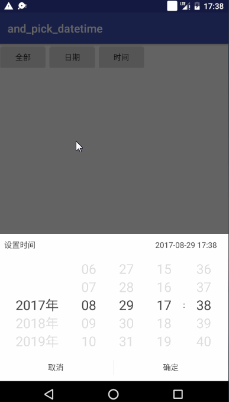

# Pick Date Time

# Features
- 简单的时间选择控件
- 可定制化

# Getting started

```java
        Calendar todayCal = Calendar.getInstance();
        Calendar startCal = Calendar.getInstance();
        Calendar endCal = Calendar.getInstance();
        endCal.add(Calendar.YEAR, 6);

        new DatePickDialog.Builder(DateParams.STYLE_ALL)
                .setCurrentDate(todayCal.getTime())
                .setStartDate(startCal.getTime())
                .setEndDate(endCal.getTime())
                .setOnSureListener(new OnSureListener() {
                    @Override
                    public void onSure(Date date) {
                        String message = new SimpleDateFormat("yyyy-MM-dd HH:mm").format(date);
                        Toast.makeText(getApplicationContext(), message, Toast.LENGTH_SHORT).show();
                    }
                })
                .show(this);
```


# ScreenShot

